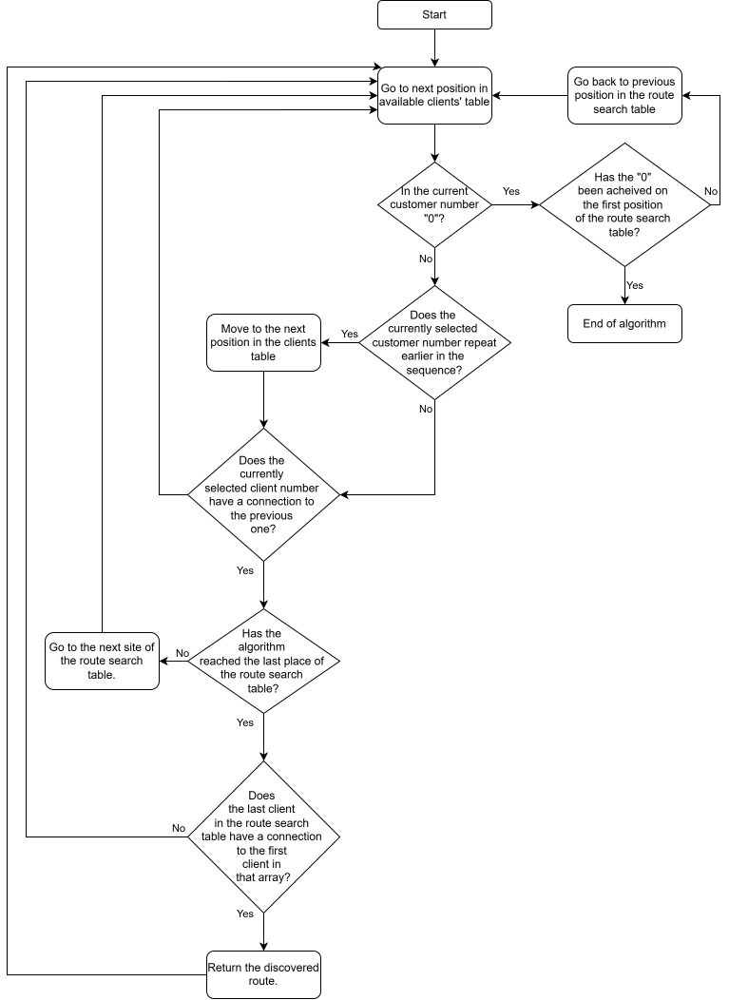

# Courier Route Optimization Program

## Project Overview

This program is designed to find the most optimal route for a courier. Based on an input file, it validates the data and reads information about connections between clients, the type of connection (one-way or two-way), and their costs. Using an implemented algorithm, it calculates all possible routes and selects the one with the lowest cost. The result, including the route, its cost, and the generation date, is saved to a `.txt` file. The program supports both single and batch execution modes.

Project created as a project on Computer Programming laboratory on Silesian University of Technology.

---

## Features

- Reads data from an input file describing connections and their costs.
- Validates and processes the input data.
- Implements a Hamiltonian cycle algorithm to determine the optimal route.
- Saves the result to a `.txt` file.
- Offers single and batch execution modes.
- Includes configurable logging and output settings.

---

## Data Structures

The program utilizes the following data structures:

### Standard Template Library (STL) Structures

- **`vector`**: Represents an array of user-defined type elements stored in contiguous memory.
- **`set`**: Stores unique values, used here to eliminate duplicate clients.
- **`map`**: Key-value pair structure used for system parameters.

### Custom Structures

- **`Edge`**: Class storing information about graph edges (client A, client B, connection direction, cost).
- **`Graph`**: Class containing a vector of edges and their count.
- **`Routes`**: Input-mapped class representing the input file structure.
- **`Trip`**: Output structure containing the optimal route.
- **`List`**: Singly linked list implemented using a template type.

### Program structure diagram

---

## Algorithm

The program's algorithm is based on the **Hamiltonian Cycle**, where each graph vertex (except the first) is visited exactly once. 

1. A connection table is created to check links between clients.
2. Possible paths are searched and analyzed.
3. Costs for the found routes are calculated, and the route with the lowest cost is selected.

### Hamiltoniam Cycle algorithm diagram

---

## Input & output file formats

### Input file
The contents of the input file have to have a following structure: `(<clientA> <direction> <clientB> : <cost>)`, for example:
```
(1 -> 3 : 2.3 ) ,
(1 <- 6 : 2.9 ) ,
(2 -> 6 : 3.8 ) ,
(2 <- 5 : 4.2 ) ,
(3 -> 4 : 4.9 ) ,
(4 -> 5 : 5.4 ) ,
```

### Output file example:
```
Input file: secondFile.txt
Date: 17/05/21 12:49:28
Trip:
1->3
3->4
4->5
5->2
2->6
6->1
Journey cost: 23.500000
```

## Usage

The program is run from the command line. 
The command requires two mandatory switches:
- **`-i <input_file_path>`** for the file that contains the connections,
- **`-o <output_file_path>`** for the output file.
The software comes with an option of running it with two optional switches:
- **`-m`**: reading multiple files from a catalogue - requires providing catalogue paths for **`-i`** and **`-o`** switches,
- **`-h`**: displays a help message.

## Additional functionalities and configuration
The program is equipped with the functionality of logging to a file or to the standard console output. The logging class can be used in any class by extending the logging base class. Thus, in any methods/constructors, the corresponding methods from the parent class for monitoring can be called. Logs can be displayed to the standard output of the console, or saved to a file with a specified destination (the property can be set in the configuration file).

The program works based on the configuration stored in the courier.properties file. This is a configuration file created in the default path of temporary files in Windows (e.g. “C:\Users\AppData\Local\Temp”). With it, the user can make the following system parameterization:
- Adding the date and time of the result generation to the file name (true/false),
- Setting logging to a file or to the console's standard output (FILE/STDOUT),
- Setting the log file saving path.

When the program is run for the first time, the configuration file takes the following default parameters:
```
outfile.name.timestamp=true
logging.appender=FILE
logging.fileoutpath="”
```
Once it is created, the user can change the parameter values in the configuration file to parameterize the program.

### Command Syntax
Example execution:
```cmd
Courier.exe -i C:\Users\User\git\Courier\inputFile.txt -o C:\Users\User\git\Courier\CourierPath.txt
```
